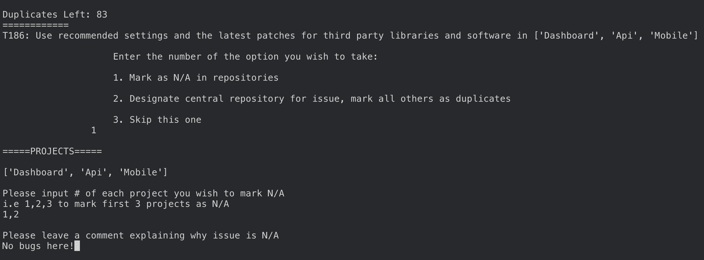

# Description
 This repository contains the infrastructure as code necessary to launch an ECS application which is backed by EC2. It is designed to be flexible to accomodate various needs. As it stands creates three services: An API, a web dashboard, and an authentication server (Keycloak). In addiiton to the infrastructure tooling here it has a docker container containing the tooling necessary to replicate the environment necessary to use the tools in this repo. 

A scripts folder exists here that contains a tool to help you identify duplicate security chores. We intend for this to all be easily repeatable, flexible, and reliable. If you find improvements to be made we hope you will submit a pull request!

# Repository Lay Out
There are fours tool repositories in this project - Mobile, Web, API, and Tools. 

Mobile contains a Flutter project written in Dart. This contains the main mobile application. 

Web contains a React project written in java script. This is the content management system of the mobile experience. 

API contains a Node/Express project that provides the infrustructure needed for the project. 

Tools contains supporting resources and AWS information. 

## Infrastructure As Code
 The infrastructure as code portion of this repository is lives under the `terraform` directory. This project uses (terragrunt)[https://terragrunt.gruntwork.io/], which is a wrapper around (terraform)[https://www.terraform.io/].

 Terragrunt provides the ability to easily repeat this infrastructure across multiple environments, handles some creation of terraform state management for you such as dynamoDB tables, and an S3 state bucket. 

 The `terraform` folder is then broken up into several subfolders -- `modules` and `us-gov-east-1`. The modules are where the repeatable aspects of the terraform code live, while the `us-gov-east-1` is where we apply those modules and pass in the variables we want.

 The general format of a terragrunt project contains `modules` a `region folder` and then sub folders broken out under the region folder for `environments` such as `dev`, `prod`, and `global`. As you will see the `env` folders contain a `terragrunt.hcl` file which declares the variables we are passing into the terraform module, and which module we are using. 

 The modules themselves vary in format but tend to at least contain `main.tf` & `variables.tf`. If we desire to pass a variable in from terragrunt into terraform it must be declared in the `variables.tf` file. The `main.tf` file is an entrypoint into our terraform code and contains the code which is actually creating our desired resources.

## Scripts

 The scripts folder is fairly simple. The important script is the `duplicate-tickets.py` and `projectIDs.py`. These two scripts work in tandem and have their own section dictating how they may be ran and with more details.

# Infrastructure Architecture


The terraform provided to you is based upon a web application which has an authentication server, an API, and a web dashboard which all communicate to a postgres database ran by RDS. Each piece of the infrastructure can be removed or resized easily to meet the needs of your specific project. The terraform here *DOES NOT* create VPCs or subnets for you. It creates an ECR (Elastic Container Registry) for you to push your docker images to, an EC2 machine which provides the compute power for your containers, an ECS (Elastic Container Service) cluster which provides the container environment for you, and an ECS service with task definitions which provide the container instructions (ENV variables, container compute allocation, and deployment instructions). 

## ECR 
The (ECR)[https://aws.amazon.com/ecr/] portion of the infrastructure is the simplest and easiest to understand. It simply creates a registry within AWS which you may then push container versions to. The `terragrunt.hcl` file located at `terraform/us-gov-east-1/global/ecr/terragrunt.hcl` declares the names of the registries which will house your docker containers.

## RDS
The RDS instance provides the database storage required. It is currently set up to be a Postgres 12 instance but this can easily be changed to meet the needs of your project by setting a variable in `terraform/us-gov-east-1/dev/db/terragrunt.hcl`. In addition the the database engine you can easily modify the size and storage capacity of your database there. The database portion of *requires* that you have two variables in AWS parameter store prior to deployment `db_username` and `db_password`. Terraform will fetch these values from parameter store and use them as the master username and master password for the database which you can then use to open a session to the database and run your `init.sql` configuration via tools such as pgadmin or psql.

In addition to creating the database itself the RDS terraform creates a security group which provides communication to the ECS task.

## ECS Cluster
The ECS cluster created by Terraform can simply be thought of as an environmental separation. It currently only accepts two variables which provide namespacing. It provides the house in which all ECS services and tasks will reside, and provides the connection between ECS and the EC2 machine providing the compute power.

## ECS EC2
This terraform module provides the EC2 machine which is used to provide computer power for the ECS cluster. Given that the EC2 machines purpose is to provide the resources for ECS the amount of task definitions ran on the machine largely determines the sizing of the machine as various machines have limited network interface capability (think I/O ports). You must provide the subnets which your application resides in and public subnets so that your application can communicate out to the public internet. The terraform here also provides the launch configuration which provides the necessary instructions for the EC2 machine to connect to the ECS cluster.

## ECS

This is the most complex terraform module within this repo. It provides the container definitions, which provide much of the same instructions you would pass via `docker run` command such as environment variables and any run commands. It contains the task definition which define the amount of compute resources your container will consume and as well as how many instances of that container you desire, its logging configuration, vpc configuration and security group ingress and egress. 

It additionally creates an application load balancer, and target group for each service.

You will be required to call this module for each service you would like to create (api, web, auth).


# How to use this code

In order to use the code here you must first ensure that you have a BESPIN AWS Account. You can reach out to Team Kratos on MatterMost and they will provision an account for you along with instructions on how to log into your account. 

## AWS Credentials

The code in this repository assumes you are using AWS as your cloud provider. You will have to get your AWS credentials and put them in your `/.aws/credentials` file. This must be on your machine, not in the docker container.

Your credentials file should look something like this
```
[default-long-term]
aws_access_key_id = ACCESS_KEY
aws_secret_access_key = SECRET_ACCESSKEY
aws_mfa_device = arn:aws-us-gov:iam::ACCOUNT_ID:mfa/AWS_USERNAME
region = us-gov-west-1
assume_role = arn:aws-us-gov:iam::ACCOUNT_ID:role/ROLE_YOU_WOULD_LIKE_TO_ASSUME

```

In order for MFA to function we recommend using (aws-mfa)[https://github.com/broamski/aws-mfa]. You can set it up to assume a role, and it will generate the MFA codes necessary are write to your aws credentials file.

An easy way to test that you have the AWS cli correctly configured is to run `aws s3 ls` which should print out the names of S3 buckets in the account.


# Deploying the Infrastructure

The infrastructure must be deployed in several steps which must be followed in order. This is due to dependency issues of certain infrastructure looking for security groups from other types of infrastructure, as an example the database must be able to talk to the ECS task so one must come before the other.

You must retrieve the VPC id's and subnets which Kratos has created for you and insert them into the correct terragrunt.hcl files where that information is needed.

[1] Create ECR

[2] Create ECS Cluster

[3] Create RDS Instance

[4] Create ECS task (ecs-api,ecs-keycloak,ecs-dashboard)

[5] Create ECS-EC2

You will likely have to reboot the EC2 machine after initial creation so that it successfully connects to the ECS Cluster. You can accomplish this by logging into the EC2 console, selecting the instance > actions > reboot.

In order to apply the terraform you must navigate to each respective Terragrunt directory

Example in order to deploy ECR you navigate to `terraform/us-gov-east-1/global/ecr/terragrunt.hcl` and run the command `terragrunt plan` to see what infrastructure it will create, this should match you expectations. You may then run a `terragrunt apply` to actually create the infrastructure. Repeat this process for each resource declared above.

# DNS
After you have applied the Terraform the applications will have publicly accessible URLs via their load balancer URL. You can find these URLs by logging into the AWS Console > EC2 > Load Balancer. Click on the respective load balancer and you will see an A-record URL which you can access in your browser.

In order to get a nice clean domain name such as `amp.teambespin.us` it is easiest to leverage the DNS terraform and pipelines which are created by Kratos. 

They will put a web-app template terraform file in your repo, which you can then add to the DNS terraform file (Example)[https://gitlab-dev.bespinmobile.cloud/corellian-engineering-corp-cec/web-app-template/-/blob/master/terraform/app/dns.tf]. Once you apply to the main branch their CI process will automatically apply the Terraform for you and your DNS records will exist.


## How to run tickets.py

###### On Mac:

Make sure you have python 3 (any version). Install packages:

`sudo pip3 install -r requirements.txt`

1. Go to GitLab and click on the user icon -> Preferences -> Access Tokens
2. Create a personal access token with the api scope
3. Create a .env file in the tools directory and enter the token value, `PRIVATE_TOKEN='token_value'`
4. Run `python3 scripts/projectIDs.py`
5. On the first run, it will output all groups available to your account. Grab the ID of the one you wish to run this script on
6. Input group ID, uncomment rest of the script and run again for project IDs. Grab whichever IDs you need
7. Modify `duplicate-tickets.py` at the commented portion depending on how many projects you have
8. Run `python3 scripts/duplicate-tickets.py`


## How it works

The script offers two main features for each duplicate story

###### 1. Mark story as 'Not Applicable' in selected repos


On gitlab:


###### 2. Mark a 'source' repository for the issue; the issues in other repos will be marked as duplicates and will include a link to the source


On the marked 'source' repo in gitlab:


On the duplicate issues:


